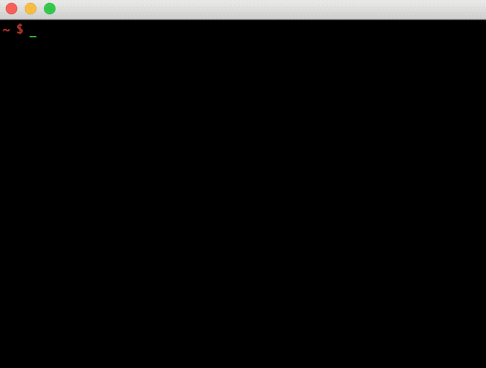

img - Command-line image viewer
===============================

A command line tool to view images (PNG, GIF, JPEG) right on the terminal. `img` comes in handy in the following scenarios:
- to view images over SSH and VPN connections (where it's cumbersome to grab images and view them on the host machine)
- can be used to generate splash screens for Linux logins (e.g. motd)
- you never have to leave the terminal if you are working with image generation code
- just for fun!

_Supported OSes:_ macOS, Linux

Installation
------------
Download the latest release for your operating system in the [releases page](https://github.com/codeliveroil/img/releases), unzip and use the binary (`img`) or run `install.sh`.

Usage
-----
```
img -h
```

**Examples:**
```
img car.png
img -w logo.sh logo.gif
img -l 2 wheel.gif
```

Demo
----
_GIF:_



_JPEG/PNG:_


Library API for GO
------------------

```golang
img := viz.Image{
	Filename:  "input.gif",
	LoopCount: 2,
}

// Read the image
if err := img.Init(); err != nil {
	//handle error
}

// Render the image
if err := img.Draw(&viz.StdWriter{}); err != nil {
	//handle error
}
```
